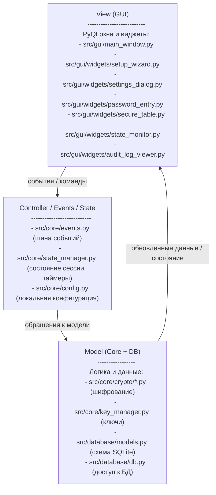

CryptoSafe Manager
==================

Продуктовое видение (Product Vision)
------------------------------------

CryptoSafe Manager – это кроссплатформенный менеджер паролей с графическим интерфейсом, локальной зашифрованной базой данных и защищённой работой с буфером обмена.  
Приложение позволяет хранить и организовывать чувствительные данные (логины, пароли, заметки и связанные метаданные) на машине пользователя и спроектировано так, чтобы его было легко дополнять новыми функциями безопасности и удобства в следующих спринтах.

Полное техническое описание и требования к спринтам находятся в папке `sprints/` (см. [project_outline.md](sprints/project_outline.md)).

Дорожная карта спринтов (8 спринтов)
------------------------------------

1. **Спринт 1 – Основы и архитектура** ([описание спринта](sprints/sprint1.md))  
   - Создать структуру проекта (`src/core`, `src/gui`, `src/database`, `tests`).  
   - Реализовать менеджер конфигурации для локальных настроек.  
   - Добавить базовую документацию с продуктовыми целями и схемой архитектуры.

2. **Спринт 2 – Локальная зашифрованная база данных** ([описание спринта](sprints/sprint2.md))  
   - Спроектировать схему локальной БД для хранения записей.  
   - Добавить базовые операции CRUD в `src/database`.  
   - Подключить простой слой шифрования для хранимых данных.

3. **Спринт 3 – Базовый графический интерфейс** ([описание спринта](sprints/sprint3.md))  
   - Создать главное окно приложения в `src/gui`.  
   - Добавить простые экраны для списка и просмотра записей.  
   - Соединить GUI с core-логикой и слоем базы данных.

4. **Спринт 4 – Аутентификация и блокировка** ([описание спринта](sprints/sprint4.md))  
   - Добавить мастер-пароль / процесс разблокировки.  
   - Реализовать автолок по неактивности.  
   - Связать автолок с настройками конфигурации.

5. **Спринт 5 – Буфер обмена и функции безопасности** ([описание спринта](sprints/sprint5.md))  
   - Реализовать контролируемое копирование в буфер обмена.  
   - Добавить таймаут очистки буфера обмена.  
   - Сделать связанные настройки доступными через менеджер конфигурации.

6. **Спринт 6 – Резервное копирование и восстановление** ([описание спринта](sprints/sprint6.md))  
   - Добавить локальное резервное копирование и восстановление зашифрованной БД.  
   - Предоставить простые инструменты экспорта и импорта.  
   - Описать стратегию бэкапов и ограничения.

7. **Спринт 7 – Улучшение удобства использования** ([описание спринта](sprints/sprint7.md))  
   - Улучшить UX и внешний вид GUI.  
   - Добавить поиск, сортировку и фильтрацию.  
   - Улучшить сообщения об ошибках и обратную связь пользователю.

8. **Спринт 8 – Укрепление безопасности и финализация** ([описание спринта](sprints/sprint8.md))  
   - Провести простой обзор безопасности и очистку кода.  
   - Добавить дополнительные тесты и лёгкое логирование.  
   - Завершить документацию и подготовить инструкции по релизу.

Структура проекта (Sprint 1)
----------------------------

- `src/core/` – основная логика, криптографические помощники и менеджер конфигурации.  
- `src/gui/` – модули и окна графического интерфейса (будут реализованы в следующих спринтах).  
- `src/database/` – доступ к локальной базе данных и модели данных.  
- `tests/` – модульные и интеграционные тесты.

Виртуальное окружение и установка (Windows, PowerShell)
-------------------------------------------------------

1. **Перейти в папку проекта**  
   Убедитесь, что вы находитесь в каталоге проекта:

   ```bash
   cd crypto
   ```

2. **Создать виртуальное окружение**  

   ```bash
   python -m venv .venv
   .venv\Scripts\Activate.ps1
   ```

3. **Установить зависимости**  
   (В спринте 1 может не быть внешних библиотек, но команда нужна для будущих спринтов.)

   ```bash
   pip install -r requirements.txt
   ```

4. **Запуск приложения**  
   Пример команды:

   ```bash
   python -m src
   ```

   (Откроется мастер первого запуска, затем основное окно.)

Обзор архитектуры (слои и потоки)
---------------------------------

Приложение разделено на несколько простых слоёв:

- **Пользовательский слой** – пользователь взаимодействует с окном приложения.  
- **Слой представления (GUI / View)** – модули в `src/gui`, отвечающие за окна, формы и отображение данных.  
- **Слой ядра (Core / Controller)** – модули в `src/core`, где живёт бизнес-логика, работа с конфигурацией и криптографией.  
- **Слой данных (Database / Model)** – модули в `src/database`, которые работают с локальной БД и её схемой.  
- **Локальные файлы** – конфигурация (`config.json`) и файл локальной БД (например, `data/cryptosafe.db`).

Ниже схема MVC-архитектуры приложения в виде трёх уровней:




Состояние после Sprint 1
------------------------

- **Архитектура и конфигурация**  
  - Реализован `ConfigManager` (`src/core/config.py`) с хранением локальных настроек в `config.json`.  
  - Добавлен `StateManager` (`src/core/state_manager.py`), который в отдельном потоке отслеживает состояние сессии (заблокировано/разблокировано), таймер буфера обмена и неактивность, а также хранит настройки в таблице `settings` с учётом окружения (`development`, `production` и т.п.).

- **База данных и криптооснова**  
  - Схема SQLite описана в `src/database/models.py` (`vault_entries`, `audit_log`, `settings`, `key_store`) с индексами и версией схемы (`PRAGMA user_version`).  
  - Класс `Database` (`src/database/db.py`) инициализирует БД и создаёт подключения, готовые к будущим миграциям и бэкапам.  
  - В `src/core/crypto/abstract.py` и `placeholder.py` описан абстрактный `EncryptionService` и заглушка `AES256Placeholder` (XOR по байтам), а `KeyManager` (`src/core/key_manager.py`) умеет получать простой 32-байтовый ключ из пароля и соли.

- **GUI на PyQt6**  
  - Главное окно (`src/gui/main_window.py`) реализовано на PyQt6: меню (Файл/Правка/Вид/Настройки/Справка), таблица записей (`SecureTable`), строка состояния с таймером буфера и статусом блокировки.  
  - Мастер первого запуска (`SetupWizard`) запрашивает мастер‑пароль (с подтверждением) и путь к файлу БД, без этого не пускает в приложение.  
  - Диалог настроек (`SettingsDialog`) содержит вкладки **Безопасность**, **Вид** и **Дополнительно**, где можно настроить таймаут буфера, автолок, язык (RU/EN) и тему (системная/светлая/тёмная).  
  - Есть дополнительные виджеты: `PasswordEntry` (поле пароля с кнопкой показать/скрыть), `AuditLogViewer` (заглушка для журнала аудита) и `StateMonitor` (простое окно с отображением текущего состояния).

- **События, аудит и безопасность**  
  - `EventBus` (`src/core/events.py`) поддерживает подписку и публикацию событий, включая асинхронные обработчики через очередь и фоновой поток.  
  - `audit_logger` подписывается на события (`EntryAdded`, `EntryUpdated`, `UserLoggedIn`, `ClipboardCopied`, `ClipboardCleared` и др.) и пишет простые записи в таблицу `audit_log`.  
  - Ввод пользователя (мастер‑пароль, подтверждение, путь к БД, таймауты) валидируется, сообщения об ошибках не раскрывают внутренние детали, в исходниках нет захардкоженных секретов.

- **Тесты и подготовка к сборке**  
  - В `tests/` есть юнит‑тесты для БД, криптозаглушек, системы событий и базового запуска окон, написанные на `unittest`, а также простой GUI‑тест на `pyautogui` (по желанию через `RUN_GUI_TESTS=1`).  
  - `requirements.txt` перечисляет зависимости с версиями (`PyQt6`, `pyautogui`), а `Dockerfile` даёт простую заготовку для будущей упаковки приложения.


Состояние после Sprint 2
------------------------

- **Схема БД и хранение ключей**  
  - Таблица `key_store` приведена к требованиям TRD: `id`, `key_type` (`auth_hash`, `enc_salt`, `params`), `key_data` (BLOB), `version`, `created_at`, реализована миграция v2→v3.  
  - Таблица `settings` используется для политики паролей, параметров формирования ключей и таймаута авто‑блокировки (`password_policy`, `key_params`, `auto_lock_timeout`).

- **KDF и криптография**  
  - В `src/core/crypto/key_derivation.py` реализованы `derive_key_pbkdf2` и `derive_key_argon2` (Argon2id), а также заготовка `derive_key_for_type` для разных типов ключей (подпись аудита, экспорт, TOTP).  
  - Параметры Argon2 ограничиваются функцией `_limit_argon2_params`, чтобы не допустить DoS‑атак чрезмерными значениями памяти и времени.

- **Аутентификация и ключи**  
  - В `src/core/crypto/authentication.py` реализована работа с мастер‑паролем: проверка сложности, установка (`set_master_password`), проверка (`verify_master_password`), разблокировка (`unlock_session`) и автозадержка при ошибках.  
  - Для аутентификации используется Argon2id (в `key_store` хранится только хэш и соль), для шифрования записей — PBKDF2‑HMAC‑SHA256 с отдельной солью, ключи кэшируются в памяти только при активной и разблокированной сессии.

- **Кэширование и авто‑блокировка**  
  - В `src/core/crypto/key_storage.py` реализован простой кеш ключей с очисткой при сворачивании окна, логауте и по таймауту неактивности (через `StateManager`).  
  - В `src/core/state_manager.py` добавлена авто‑блокировка: при достижении `auto_lock_timeout` сессия блокируется, кэш ключей очищается, публикуется событие `UserLoggedOut`.

- **Keychain и контроль безопасности**  
  - Для хранения секретов ОС используется библиотека `keyring`; для ключа шифрования (`master_enc`) при недоступности keyring fallback‑запись в файл отключена.  
  - Добавлены простые проверки безопасности (SEC‑1–SEC‑4): мастер‑пароль нигде не хранится в открытом виде, ключ шифрования не записывается на диск, криптооперации идут через `hashlib` и `argon2-cffi`, параметры Argon2 валидируются.

- **Тестирование криптографии и смены пароля**  
  - Файл `tests/test_security.py` содержит тесты для Argon2 (валидность и консистентность), PBKDF2, проверки константного времени сравнения хешей, обнуления ключей в памяти и интеграционный сценарий смены мастер‑пароля с проверкой доступа ко всем записям.


Запуск тестов Sprint 2
----------------------

- **Запуск всех тестов проекта** (из корня репозитория, в активированном `.venv`):

  ```bash
  python -m unittest discover -v
  ```

- **Запуск только тестов безопасности Sprint 2**:

  ```bash
  python -m unittest tests.test_security -v
  ```

