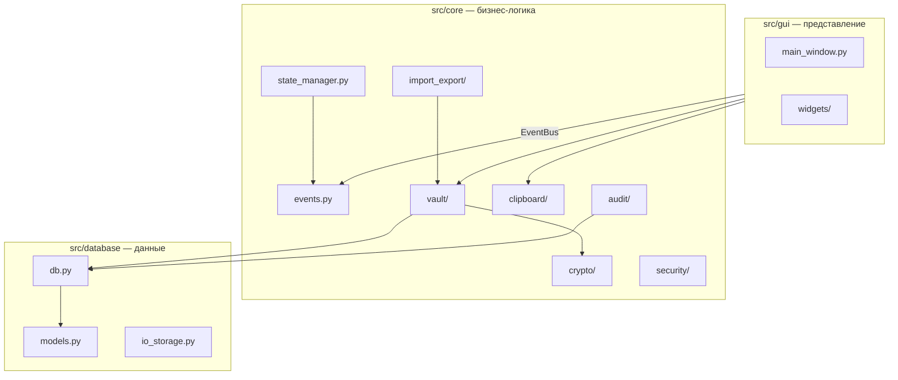

# CryptoSafe Manager — техническое описание

Sprint 8 / DOC-3. Архитектура, криптография и структуры данных.

---

## 1. Обзор архитектуры

CryptoSafe Manager — десктопное приложение на **Python 3.10+** и **PyQt6**. Логика разделена на слои без циклических зависимостей (Sprint 8 / INT-2).



### Порядок инициализации

`src/bootstrap.py` → `initialize_application()`:

1. Config + EventBus  
2. Audit subscribers  
3. StateManager (фоновый поток)  
4. Security integration  
5. GUI (`run_app()`)

### Точки входа

| Команда | Модуль |
|---------|--------|
| `python run.py` | `run.py` → `bootstrap.main()` |
| `python -m src` | `src/__main__.py` |
| PyInstaller | `run.py` |

### Ключевые паттерны

- **EventBus** — слабая связность (логин, clipboard, vault, audit).
- **Session gate** — `is_session_unlocked()` блокирует операции с секретами.
- **Key cache** — ключ vault только в RAM при активной сессии.
- **Lazy imports** — разрыв циклов между crypto ↔ vault ↔ authentication.

---

## 2. Криптографические решения

### 2.1 Мастер-пароль и аутентификация

| Компонент | Алгоритм | Назначение |
|-----------|----------|------------|
| Хэш мастер-пароля | **Argon2id** (`argon2-cffi`) | Проверка пароля при входе |
| Соль auth | Случайная, в `key_store` | Уникальность хэша |
| Сравнение хэшей | Constant-time | Защита от timing-атак |

Мастер-пароль **не хранится**; в БД только `auth_hash` + параметры KDF.

### 2.2 Ключ шифрования vault

| Компонент | Алгоритм | Назначение |
|-----------|----------|------------|
| KDF vault | **PBKDF2-HMAC-SHA256** (100k iter) | Ключ AES из мастер-пароля |
| Соль enc | Отдельная от auth, в `key_store` | Domain separation |
| Кэш | In-memory, `key_storage.py` | Без записи ключа на диск |

Опционально: обёртка ключа через **OS keyring** (`keyring`).

### 2.3 Шифрование записей vault

| Компонент | Алгоритм | Формат |
|-----------|----------|--------|
| Шифрование полей | **AES-256-GCM** | `nonce (12) ‖ ciphertext ‖ tag` в BLOB |
| Сервис | `VaultEncryptionService` | JSON записи → bytes → AES-GCM |

Каждая запись в `vault_entries.encrypted_data` — отдельный AEAD-блок.

### 2.4 Import / Export / Share

| Контекст | KDF / шифр | Примечание |
|----------|------------|------------|
| Файл экспорта | PBKDF2 + **AES-256-GCM** | Контекст HKDF `vault-export` |
| Подпись экспорта | HMAC-SHA256 | Отдельный `derive_export_key` |
| Share-пакет | AES-GCM + опционально ECIES/RSA | `share_crypto.py` |
| Сжатие | GZIP (опционально) | Перед шифрованием тела |

### 2.5 Audit log

| Компонент | Алгоритм |
|-----------|----------|
| Цепочка хэшей | SHA-256 (`previous_hash` → `entry_hash`) |
| Подпись записи | **Ed25519** (ключ в `audit_public_keys`) |
| Экспорт журнала | AES-256-GCM (.enc) |

### 2.6 Буфер обмена

- XOR-маскирование секрета в памяти (`SecureClipboardItem`).
- В системный буфер попадает **hex-обфусцированное** значение, не plaintext.
- `secure_wipe` / VirtualLock (best-effort на Windows).

### 2.7 Параметры (сводка)

```
Auth:     Argon2id (time/memory из settings / defaults)
Vault:    PBKDF2-HMAC-SHA256, 256-bit key, AES-256-GCM
Export:   PBKDF2 + HKDF info "vault-export" / "export-enc"
Audit:    Ed25519 + SHA-256 chain
Share:    AES-GCM, hybrid RSA-OAEP / ECIES для pubkey-режима
```

---

## 3. Структуры данных и схема БД

**Версия схемы:** `PRAGMA user_version = 10` (`models.CURRENT_DB_VERSION`).

### 3.1 Основные таблицы

#### `vault_entries`

| Колонка | Тип | Описание |
|---------|-----|----------|
| `id` | INTEGER PK | ID записи |
| `encrypted_data` | BLOB | AES-GCM blob (JSON записи) |
| `created_at` | TEXT | ISO UTC |
| `updated_at` | TEXT | ISO UTC |
| `tags` | TEXT | Теги через запятую |

#### `deleted_entries` (soft delete)

| Колонка | Тип | Описание |
|---------|-----|----------|
| `id` | INTEGER PK | ID исходной записи |
| `encrypted_data` | BLOB | Копия blob |
| `deleted_at` | TEXT | Время удаления |
| `expires_at` | TEXT | Автоочистка корзины |

#### `key_store`

| `key_type` | `key_data` (BLOB) |
|------------|-------------------|
| `auth_hash` | Argon2 hash |
| `enc_salt` | Соль PBKDF2 vault |
| `params` | JSON параметров KDF |

#### `settings`

Ключ-значение (`setting_key`, `setting_value`, `encrypted`).

Примеры ключей: `auto_lock_timeout`, `clipboard_timeout`, `audit_max_entries`, `password_policy`.

#### `audit_log`

| Колонка | Тип |
|---------|-----|
| `sequence_number` | INTEGER PK |
| `timestamp` | TEXT |
| `event_type` | TEXT |
| `entry_id` | INTEGER FK |
| `previous_hash` | TEXT |
| `entry_data` | BLOB (JSON signed payload) |
| `signature` | TEXT |

Триггеры **append-only** (`audit_security.py`).

#### Import/Export (Sprint 6)

| Таблица | Назначение |
|---------|------------|
| `shared_entries` | Факты share по записям |
| `contacts` | Публичные ключи контактов |
| `io_history` | История import/export |
| `share_inbox` | Пакеты по token (ссылки) |

### 3.2 Логическая модель записи (plaintext)

```python
{
    "title": str,
    "username": str,
    "password": str,
    "url": str,
    "notes": str,
    "tags": str,
    "category": str,  # optional
}
```

`EntryManager` / `VaultEntry` dataclass — CRUD + шифрование через `VaultEncryptionService`.

### 3.3 Форматы файлов

| Формат | Маркер | Модуль |
|--------|--------|--------|
| Native export | `cryptosafe_export` | `native_json_format.py` |
| Share | `cryptosafe_share: true` | `share_json_format.py` |
| Bitwarden | `items[]` | `bw_json_format.py` |
| CSV / LastPass | `csv_body` | `csv_format.py`, `lastpass_csv_format.py` |

### 3.4 EventBus (основные события)

`UserLoggedIn`, `UserLoggedOut`, `EntryCreated`, `EntryUpdated`, `EntryDeleted`,  
`ClipboardCopied`, `ClipboardCleared`, `VaultExported`, `VaultImported`, `VaultShared`,  
`PanicModeActivated`, `SecurityHardening`.

---

## 4. Тестирование и качество

- **pytest** — `tests/`, coverage ≥ 80% (`tests/generate_test_report.py`).
- GUI исключён из coverage (`.coveragerc`); core покрыт unit-тестами.
- Отчёт: `tests/report/summary.md`.

---

## 5. Сборка и развёртывание

- **PyInstaller** one-folder: `cryptosafe.spec`, `dist/CryptoSafeManager/`.
- Зависимости: `requirements.txt` (runtime + test), `requirements-build.txt` (PyInstaller).

---

## См. также

- [user_guide.md](user_guide.md) — инструкции для пользователя  
- [README.md](../README.md) — обзор и быстрый старт  
- `sprints/sprint8.md` — полное ТЗ Sprint 8
