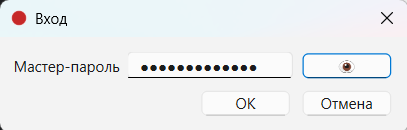
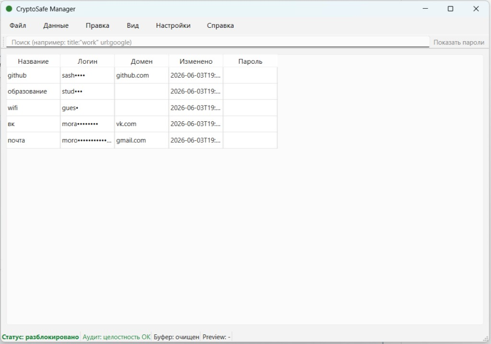
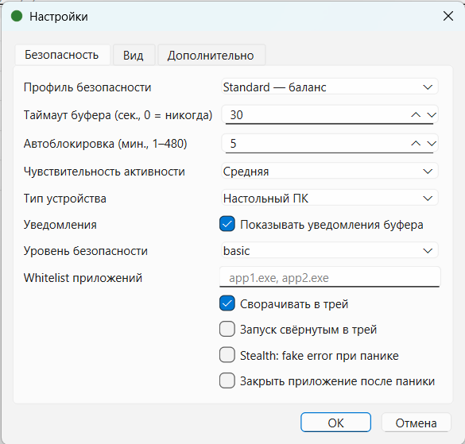
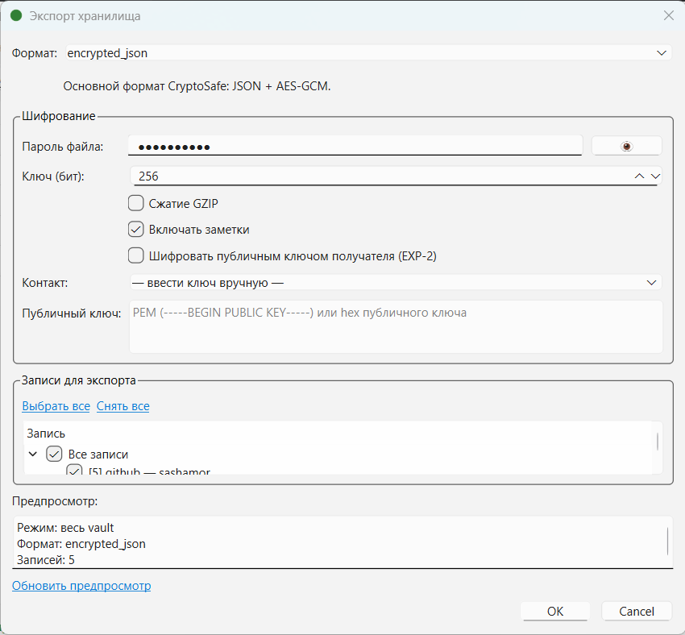

# CryptoSafe Manager — руководство пользователя

**Sprint 8 / DOC-2.** Пошаговые инструкции по установке, vault, буферу обмена, import/export и резервному копированию.

---

## Содержание

1. [Установка и запуск](#1-установка-и-запуск)
2. [Мастер-пароль и vault](#2-мастер-пароль-и-vault)
3. [Записи vault](#3-записи-vault)
4. [Защищённый буфер обмена](#4-защищённый-буфер-обмена)
5. [Импорт, экспорт и резервное копирование](#5-импорт-экспорт-и-резервное-копирование)
6. [Журнал аудита и настройки](#6-журнал-аудита-и-настройки)
7. [Где хранятся данные](#7-где-хранятся-данные)

---

## 1. Установка и запуск

### 1.1 Из исходников (Windows, macOS, Linux)

| Шаг | Действие |
|-----|----------|
| 1 | Установите **Python 3.10+** |
| 2 | Клонируйте репозиторий и перейдите в каталог проекта |
| 3 | Создайте виртуальное окружение и установите зависимости |

```bash
git clone https://github.com/alexandra-mrz/CryptoSafe-Manager.git crypto
cd crypto

python -m venv .venv
```

Активация окружения:

```bash
# Windows (PowerShell)
.venv\Scripts\activate

# macOS / Linux
source .venv/bin/activate
```

Установка пакетов:

```bash
pip install -r requirements.txt
```

Дополнительно для QR (по желанию):

| ОС | Команда |
|----|---------|
| macOS | `brew install zbar` |
| Ubuntu / Debian | `sudo apt install libzbar0 xclip` |

Запуск:

```bash
python run.py
```

Альтернативы: `python -m src`, `python main.py`.

### 1.2 Из собранного приложения (Windows)

| Шаг | Действие |
|-----|----------|
| 1 | Распакуйте `CryptoSafeManager-Windows.zip` или папку `dist/CryptoSafeManager/` |
| 2 | Убедитесь, что рядом с `CryptoSafeManager.exe` есть каталог `_internal/` |
| 3 | Запустите **CryptoSafeManager.exe** |

> Не переносите на другой диск только один файл `.exe` — нужна **вся папка** приложения.

Сборка exe на Windows: см. [README.md](../README.md#4-сборка-executable-windows-pkg-1).

### 1.3 macOS и Linux без Python

Соберите приложение **на той же ОС**, где будете запускать:

```bash
chmod +x scripts/build_exe.sh
./scripts/build_exe.sh
# macOS: open dist/CryptoSafeManager/CryptoSafeManager
# Linux: ./dist/CryptoSafeManager/CryptoSafeManager
```

---

## 2. Мастер-пароль и vault

### 2.1 Первый запуск

1. Запустите приложение — откроется **мастер первого запуска** (Setup Wizard).
2. Задайте **мастер-пароль** дважды. Требования: длина и сложность (цифры, регистр, спецсимволы).
3. Укажите путь к файлу базы (по умолчанию `data/cryptosafe.db`).
4. После завершения vault создан; все записи шифруются ключом, производным от мастер-пароля.

> **Важно:** мастер-пароль **не восстанавливается**. Потеря пароля = потеря доступа к данным.

### 2.2 Разблокировка

При каждом запуске (или после блокировки) введите мастер-пароль в диалоге **Unlock vault**.



### 2.3 Смена мастер-пароля

**Файл → Сменить мастер-пароль** — нужен текущий пароль; все записи перешифровываются новым ключом.

### 2.4 Блокировка

| Способ | Действие |
|--------|----------|
| Вручную | **Вид → Заблокировать** или **Ctrl+L** |
| Автоматически | Неактивность — **Настройки → Безопасность** |
| Экстренно | **Ctrl+Shift+P** (panic mode: буфер, блокировка, скрытие окна) |

---

## 3. Записи vault

### 3.1 Главное окно

Список записей (Title, Username, URL, Tags). Строка поиска фильтрует записи; поддерживаются фильтры вида `title:банк`.



### 3.2 Добавить запись

1. **Правка → Добавить** или **Ctrl+N**.
2. Заполните поля: название, логин, пароль, URL, заметки, теги.
3. Кнопка **генератора пароля** — длина и наборы символов (A-Z, a-z, 0-9, спецсимволы).
4. **Сохранить**.

### 3.3 Изменить запись

1. Выберите строку в таблице.
2. **Правка → Изменить**, двойной щелчок или контекстное меню.
3. Сохраните изменения.

### 3.4 Удалить запись

1. Выберите запись.
2. **Правка → Удалить** или **Delete**.
3. Подтвердите удаление.

По умолчанию используется **мягкое удаление**: запись скрывается из списка, копия остаётся в БД (`deleted_entries`) для возможного восстановления в будущих версиях.

---

## 4. Защищённый буфер обмена

CryptoSafe копирует секреты с **автоочисткой** и **обфускацией** в системном буфере (не plaintext).

### 4.1 Как пользоваться

1. Разблокируйте vault.
2. Скопируйте пароль или логин из записи (кнопка в таблице или контекстное меню).
3. Вставьте в нужное приложение в течение таймаута (по умолчанию **30 с**).
4. В **строке состояния** отображается обратный отсчёт; затем буфер очищается.

### 4.2 Настройки

**Настройки → Безопасность → Таймаут буфера обмена**

- диапазон **5–300 с**;
- **0** — без автоочистки (не рекомендуется).



### 4.3 Ручная очистка

**Правка → Очистить буфер**

### 4.4 Защита от подмены

Если другое приложение изменило буфер, CryptoSafe может ускоренно очистить секрет и (в режиме «paranoid») временно запретить копирование до разблокировки.

---

## 5. Импорт, экспорт и резервное копирование

### 5.1 Экспорт vault

1. **Данные → Экспорт...**
2. Выберите формат: зашифрованный JSON, CSV, Bitwarden JSON, LastPass CSV и др.
3. Задайте **пароль файла экспорта** (отдельный от мастер-пароля).
4. Укажите путь сохранения.



### 5.2 Импорт

1. **Данные → Импорт...**
2. Выберите файл (JSON, CSV, Bitwarden, LastPass, share-пакет).
3. Введите пароль файла, если он зашифрован.
4. Режим: **объединить**, **заменить** или **пробный прогон** (dry run).

### 5.3 Обмен одной записью (Share)

1. **Данные → Обмен записью...**
2. Выберите запись, способ (пароль / публичный ключ / ссылка), срок действия.
3. Сохраните `share.json`, QR-код или ссылку `cryptosafe://share/...`.

### 5.4 QR-код

**Данные → Сканировать QR (камера)...** — импорт ключа контакта или share-пакета.  
Требуются: `pyzbar`, Pillow, доступная камера.

### 5.5 Резервная копия и восстановление

Полная копия файла базы SQLite (включая ключи и журнал аудита).

| Действие | Меню |
|----------|------|
| Создать копию | **Файл → Резервная копия...** → сохранить `*.db` |
| Восстановить | **Файл → Восстановить из копии...** → выбрать файл + подтвердить мастер-паролем |

При восстановлении:

- текущая база сохраняется как `cryptosafe.pre-restore-<дата>.db` рядом с основным файлом;
- после операции нужен **повторный вход** с мастер-паролем.

> Храните backup отдельно от мастер-пароля в безопасном месте.

---

## 6. Журнал аудита и настройки

### 6.1 Журнал аудита

**Вид → Журнал аудита** — просмотр подписанных событий (вход, CRUD, буфер, export/import и др.).

| Возможность | Описание |
|-------------|----------|
| Просмотр | Фильтр по типу события, поиск |
| Целостность | Проверка цепочки хэшей при старте (статус в строке состояния) |
| Экспорт | Выгрузка подписанного JSON для внешнего анализа |

Секреты (пароли, ключи) в журнал **не попадают**.

### 6.2 Прочие возможности

| Функция | Где найти |
|---------|-----------|
| Настройки безопасности | **Настройки → Параметры** |
| Монитор состояния | **Вид → Монитор состояний** |
| Быстрый поиск | **Ctrl+F** |
| Иконка в трее | Сворачивание в трей, блокировка, panic |

---

## 7. Где хранятся данные

| Файл | Назначение |
|------|------------|
| `data/cryptosafe.db` | Зашифрованная SQLite БД (записи, audit, настройки) |
| `config.json` | Локальные настройки приложения (таймауты, пути) |

Пути могут отличаться, если при первом запуске вы указали другой каталог.

---

## Контакт

**Автор:** Морозова Александра Эдуардовна  
**Группа:** ИСБ-124  
**Email:** morozovaalexandera3@gmail.com  
**Репозиторий:** https://github.com/alexandra-mrz/CryptoSafe-Manager.git

---

## См. также

- [README.md](../README.md) — обзор, установка, тесты, сборка exe
- [technical.md](technical.md) — архитектура и криптография (DOC-3)
- [sprints/sprint8.md](../sprints/sprint8.md) — требования Sprint 8
